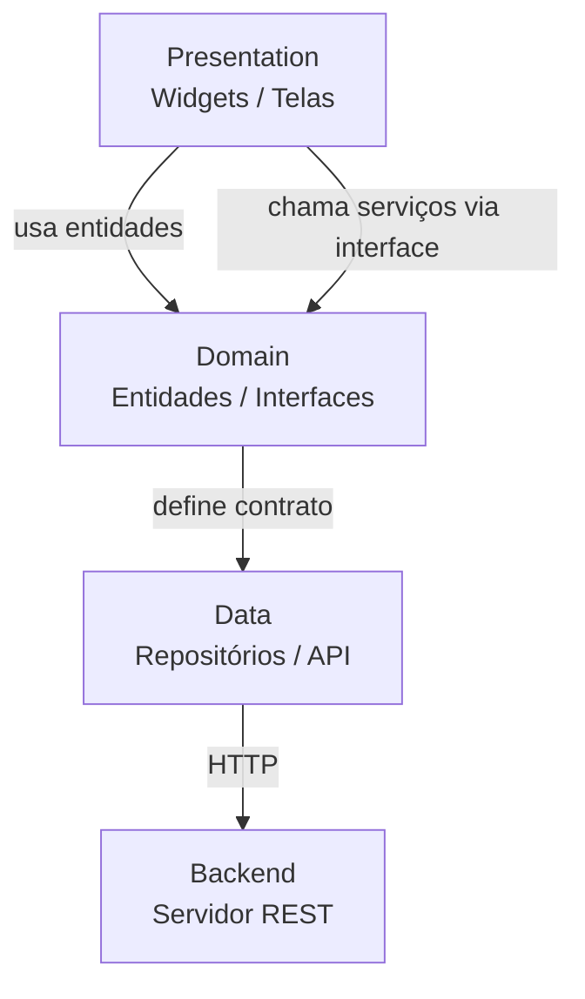
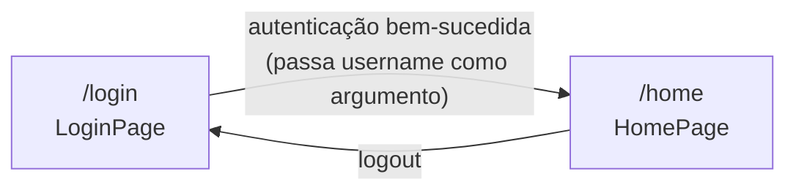

# Arquitetura e Estrutura do Projeto Mobile

## Visão Geral

Aplicativo Flutter desenvolvido como parte do **Sistema Distribuído 2026 - Facvest**.
O projeto adota uma arquitetura inspirada no **Clean Architecture**, organizando o código em camadas bem definidas por feature.

---

## Arquitetura

A arquitetura utilizada é baseada nos princípios do **Clean Architecture**, separando responsabilidades em três camadas principais dentro de cada feature:

```
presentation  →  Widgets, telas e estilos visuais
domain        →  Entidades, interfaces e regras de negócio
data          →  (a implementar) Repositórios e fontes de dados externas
```

### Fluxo de dados



### Navegação



---

## Estrutura de Pastas

```
app/
├── lib/
│   ├── main.dart                          # Ponto de entrada, configuração de rotas
│   └── core/
│       └── features/
│           ├── login/
│           │   ├── domain/
│           │   │   ├── entities/
│           │   │   │   └── UserAuthentication.dart    # Entidade de autenticação
│           │   │   └── services/
│           │   │       └── IUserAuthenticationSerivce.dart  # Interface do serviço
│           │   └── presentation/
│           │       ├── login_presenter.dart           # Tela de login
│           │       └── styles/
│           │           ├── login_input_styles.dart    # Estilo dos campos de texto
│           │           └── login_snackbar_styles.dart # Estilo das snackbars
│           └── home/
│               └── presentation/
│                   └── home_presenter.dart            # Tela de boas-vindas
├── assets/
│   └── images/
│       └── background_login.png           # Imagem de fundo do login (adicionar manualmente)
├── test/
│   └── widget_test.dart                   # Testes de widget
└── pubspec.yaml                           # Dependências e configuração do projeto
```

---

## Camadas por Feature

### `login`

| Camada | Arquivo | Responsabilidade |
|---|---|---|
| Domain / Entity | `UserAuthentication.dart` | Modelo com `username` e `password` |
| Domain / Service | `IUserAuthenticationSerivce.dart` | Contrato (interface) para autenticação |
| Presentation | `login_presenter.dart` | Tela de login com campos e lógica de navegação |
| Presentation / Style | `login_input_styles.dart` | Decoração reutilizável para `TextField` |
| Presentation / Style | `login_snackbar_styles.dart` | Snackbars de sucesso e erro |

### `home`

| Camada | Arquivo | Responsabilidade |
|---|---|---|
| Presentation | `home_presenter.dart` | Tela de boas-vindas com nome do usuário e botão de logout |

---

## Rotas

| Rota | Widget | Descrição |
|---|---|---|
| `/login` | `LoginPage` | Tela inicial de autenticação |
| `/home` | `HomePage` | Tela pós-login com boas-vindas |

A navegação utiliza `Navigator.pushNamedAndRemoveUntil` para limpar a pilha ao transitar entre login e home, impedindo que o usuário volte com o botão físico.

---

## Dependências

| Pacote | Versão | Uso |
|---|---|---|
| `flutter` | SDK | Framework principal |
| `cupertino_icons` | ^1.0.8 | Ícones estilo iOS |
| `flutter_lints` | ^6.0.0 | Regras de lint (dev) |

---

## O que falta implementar

- **Camada `data`** para cada feature: repositórios concretos que implementem as interfaces de `domain/services`
- **Integração com o backend**: substituir a autenticação hardcoded (`admin/1234`) pela chamada real via `IAuthenticationService`
- **Imagem de fundo**: adicionar `background_login.png` em `assets/images/`
- **Gerenciamento de estado**: considerar `Provider`, `Riverpod` ou `BLoC` conforme o projeto crescer
- **Testes**: expandir `widget_test.dart` com casos de login válido e inválido
