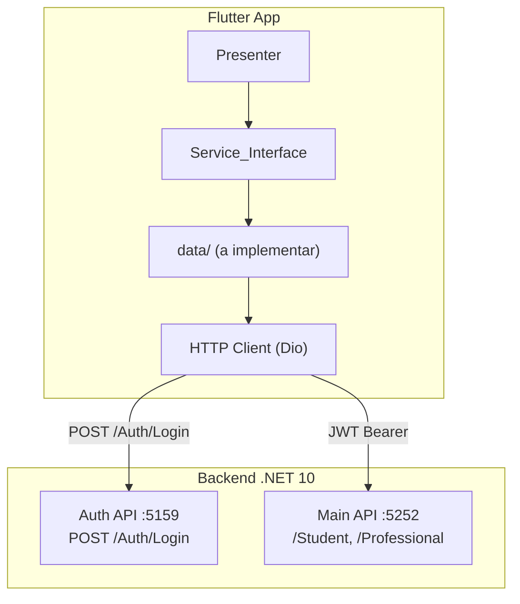

# Plano de Integração Mobile ↔ Backend

## Contexto Arquitetural



## Mapeamento App ↔ Backend

- **Login** → `POST http://localhost:5159/Auth/Login` (email + password)
- **Perfil** → `GET /Student/GetById/{id}` + `PUT /Student/UpdateStudent/{id}`
- **Profissionais** → `GET /Professional/GetAll` — *ver nota abaixo*
- **Avaliações** → Endpoints ainda não existem no backend — precisam ser criados
- **Home** → Dados compostos de Student + próxima avaliação

> **Nota importante:** O backend ainda não tem endpoints para `Professionals (GET list)` nem para `Avaliações`. O plano inclui criá-los no backend também.

## Gaps Identificados (o que falta no backend)

- `GET /Professional/GetAll` — listar profissionais
- `GET /Professional/GetById/{id}` — detalhe do profissional
- Toda a feature de **Avaliações** (`tb_Assessments`) — modelo, repositório, handlers, controller

## Estrutura de Pastas a Criar no Flutter

Cada feature receberá sua camada `data/`:

```
lib/core/features/
├── login/data/
│   ├── login_service_impl.dart       ← implementa IUserAuthenticationService
│   └── dtos/login_response_dto.dart
├── perfil/data/
│   ├── perfil_service_impl.dart
│   └── dtos/student_dto.dart
├── profissionais/data/
│   ├── profissionais_service_impl.dart
│   └── dtos/professional_dto.dart
├── avaliacoes/data/
│   ├── avaliacoes_service_impl.dart
│   └── dtos/assessment_dto.dart
└── shared/
    ├── http/api_client.dart           ← Dio + interceptors JWT
    ├── http/auth_interceptor.dart     ← injeta Bearer token
    └── storage/token_storage.dart     ← SharedPreferences
```

## Dependências Adicionadas (`pubspec.yaml`)

```yaml
dio: ^5.7.0
shared_preferences: ^2.3.3
flutter_secure_storage: ^9.2.2  # armazenar JWT
get_it: ^8.0.0                   # injeção de dependência simples
```

## Etapas de Implementação

### Fase 1 — Infraestrutura HTTP (Flutter)
- [ ] Adicionar dependências ao `pubspec.yaml`
- [ ] Criar `api_client.dart` com Dio, baseUrl, timeout
- [ ] Criar `auth_interceptor.dart` para injetar `Authorization: Bearer <token>`
- [ ] Criar `token_storage.dart` com FlutterSecureStorage
- [ ] Criar `service_locator.dart` com GetIt

### Fase 2 — Autenticação (Flutter + Backend)
- [ ] Implementar `login_service_impl.dart` → `POST /Auth/Login`
- [ ] Atualizar `login_presenter.dart` para usar o serviço real (remover `admin/1234`)
- [ ] Implementar a feature `register/` (ainda vazia) se necessário

### Fase 3 — Endpoints faltantes (Backend .NET)
- [ ] Criar `GET /Professional/GetAll` e `GET /Professional/GetById/{id}`
- [ ] Criar entidade `Assessment`, migration, repositório
- [ ] Criar endpoints `GET /Assessment/GetAll`, `GET /Assessment/GetById/{id}`, `POST /Assessment/Create`

### Fase 4 — Camada Data das features (Flutter)
- [ ] `profissionais/data/` → conectar com `/Professional/GetAll` e `/GetById/{id}`
- [ ] `avaliacoes/data/` → conectar com `/Assessment/GetAll` e `/GetById/{id}`
- [ ] `perfil/data/` → conectar com `/Student/GetById/{id}` e `UpdateStudent`

### Fase 5 — Atualizar Presenters
- [ ] Remover todos os dados mock (`// Dados mock — futuramente virão de uma API`)
- [ ] Injetar as implementações concretas via `service_locator.dart`
- [ ] Adicionar tratamento de erro (loading states, snackbars de erro)

### Fase 6 — Unificação de entidades
- [ ] Unificar `Avaliation` (home) com `Assessment` (avaliacoes) em uma única entidade

## Arquivos-Chave Referenciados

### Flutter (Mobile)
- `Mobile/app/pubspec.yaml` — dependências
- `Mobile/app/lib/main.dart` — registrar rotas e service locator
- `Mobile/app/lib/core/features/login/presentation/login_presenter.dart` — remover hardcode `admin/1234`
- `Mobile/app/lib/core/features/login/domain/services/IUserAuthenticationSerivce.dart` — interface base para implementação
- `Mobile/app/lib/core/features/home/presentation/home_presenter.dart` — dados mock a remover
- `Mobile/app/lib/core/features/profissionais/presentation/profissionais_presenter.dart` — dados mock a remover
- `Mobile/app/lib/core/features/avaliacoes/presentation/avaliacoes_presenter.dart` — dados mock a remover
- `Mobile/app/lib/core/features/perfil/presentation/perfil_presenter.dart` — dados mock a remover

### Backend (.NET 10)
- `Server/SD_Server/Controllers/Professional/ProfessionalController.cs` — adicionar endpoints GET
- `Server/SD_Server.Application/Features/Professionals/` — adicionar handlers de listagem
- `Server/SD_Server.Domain/Features/Professionals/Professional.cs` — entidade existente
- `Server/SD_Server.Infra.Data/` — adicionar entidade Assessment + migration

## URLs do Backend

| Serviço | HTTP | HTTPS | Docs |
|---|---|---|---|
| Auth API | `http://localhost:5159` | `https://localhost:7289` | `/scalar` |
| Main API | `http://localhost:5252` | `https://localhost:7171` | `/scalar` |

## Endpoints do Backend

### Auth API (`localhost:5159`)
| Método | Rota | Auth | Descrição |
|---|---|---|---|
| `POST` | `/Auth/Login` | Não | Login — retorna JWT |

### Main API (`localhost:5252`)
| Método | Rota | Roles | Descrição |
|---|---|---|---|
| `POST` | `/Student/Create` | Admin, Professional | Criar estudante |
| `GET` | `/Student/GetAll` | Admin | Listar estudantes |
| `GET` | `/Student/GetById/{id}` | Admin, Professional | Buscar estudante |
| `PUT` | `/Student/UpdateStudent/{id}` | Professional | Atualizar estudante |
| `DELETE` | `/Student/DeleteStudent/{id}` | Admin, Professional | Deletar estudante |
| `POST` | `/Professional/Create` | Admin | Criar profissional |
| `GET` | `/Professional/GetAll` | *(a criar)* | Listar profissionais |
| `GET` | `/Professional/GetById/{id}` | *(a criar)* | Detalhe do profissional |
| `GET` | `/Assessment/GetAll` | *(a criar)* | Listar avaliações |
| `GET` | `/Assessment/GetById/{id}` | *(a criar)* | Detalhe da avaliação |
| `POST` | `/Assessment/Create` | *(a criar)* | Criar avaliação |
